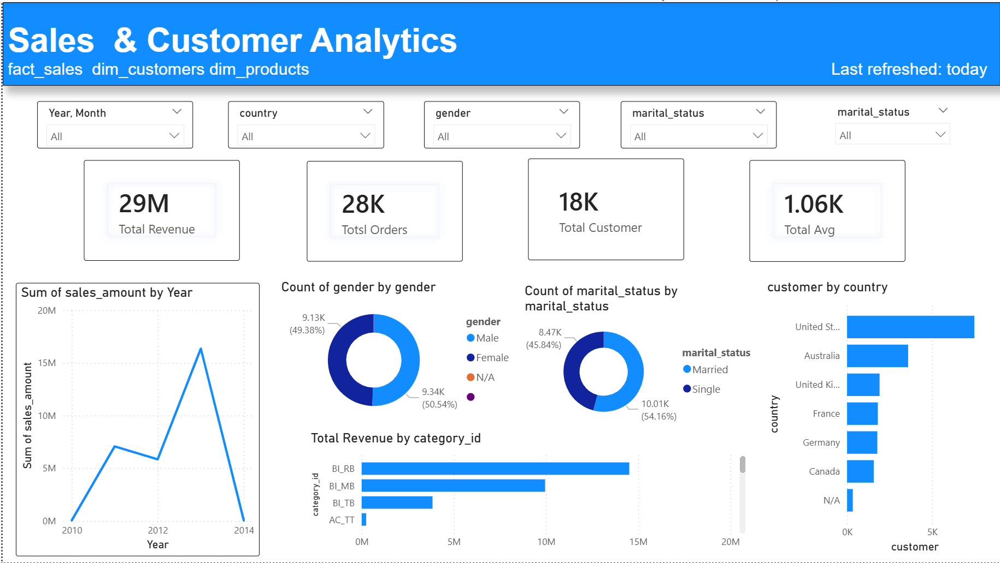

# sql-data-warehouse-project
In this project i have clean real world data and using **medallion architecture** i filtered the data from bronze to silver to gold and ready to use in power bi dashboards.

# In this project we are using **SQL Management Studio** **Github** **SQL**
## First we folder datasets inside that erm and crp data which not clean first we have to clean it
1.  CREATE DATABASE
2. Now, Inside that database create schema we follow medallion architecture bronze/silver/gold
3. Inside bronze table create tables according to erp and crm data
4. Now we have to insert data using **BULK INSERT** and before insert make to truncate table otherwise it will insert data again and again if anybody run query
5. Now check column one by one remove null,negative value,0,trim spaces,make key column perfect so it match with another tables primary key 
6. And now in silver schema create table and we will add one more column of datetimeinsertion so it will determine whether the data is inserted according to it.
7. Insert data in silver using **INSERT silver.table_name** and create **STORE PRODCURE**
8. Now in silver table join different tables according to it based on columns and create **STORE PRODCURE**
9. In Gold table we join silver prodcure with gold tables and **CREATE VIEW** 